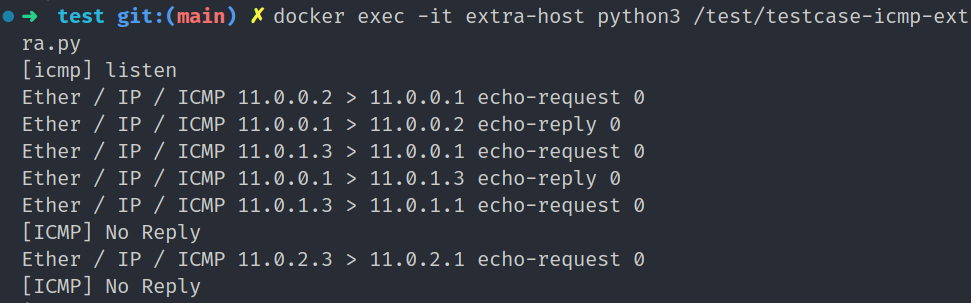
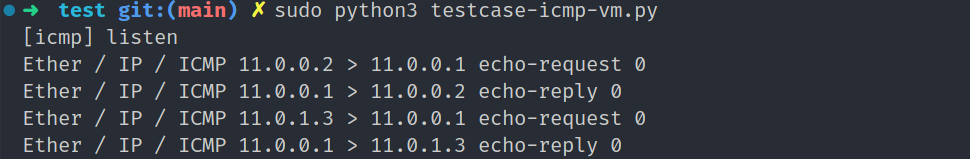
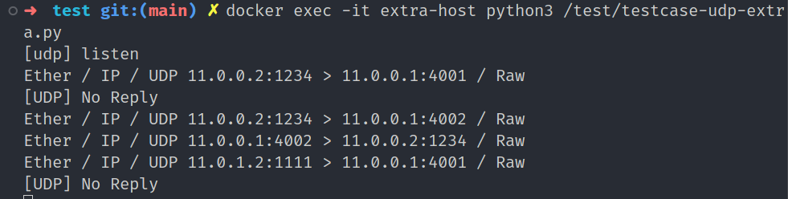
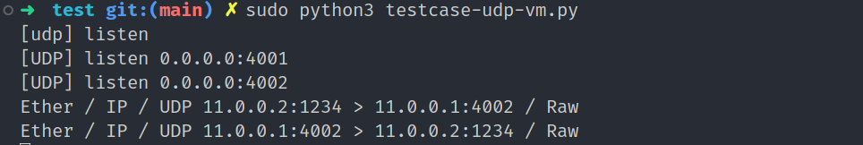
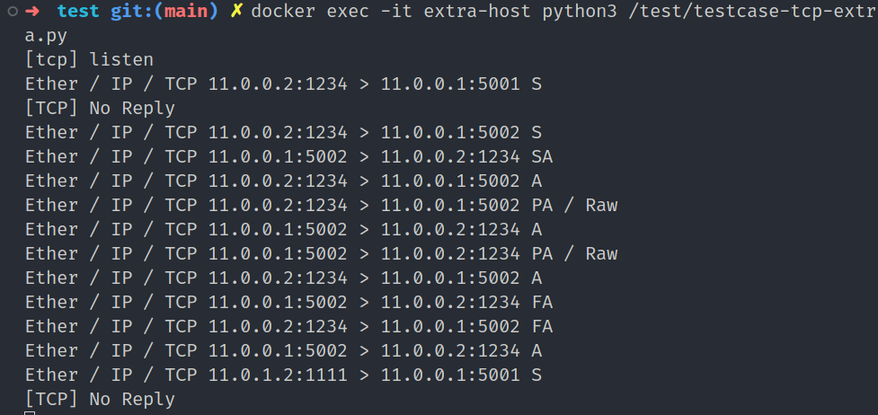
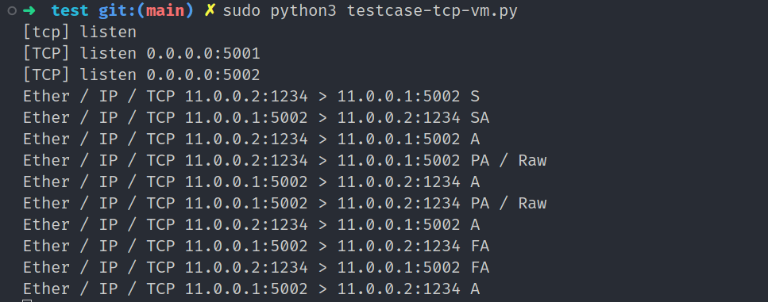
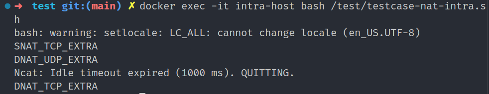
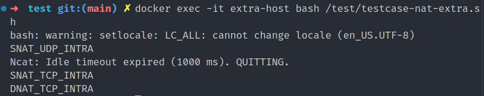

# lite-filter

基于Netfilter的轻量状态检测防火墙 | HUSTCSE 计算机网络安全课程设计

> 开发测试环境
> 
> 内核: 5.15.0-125-generic
> 
> 发行版: Ubuntu 22.04.5 LTS
> 
> 编译器: gcc version 11.4.0 (Ubuntu 11.4.0-1ubuntu1~22.04)
> 
> 测试环境: Docker version 24.0.7
> 
>         docker-compose version 1.29.2

```
lite-filter v1.0

Usage: lite-filter CMD
Commands:
  help
        show help infomation
  start [-c /path/to/config]
        install module use config file, default /etc/lite-filter/lite-filter.conf
  stop
        remove module
  load [-f /path/to/rule]
        load rules from rule file, default stdin
  save [-f /path/to/rule]
        save rules to file, default stdout
  log [patterns]
        show lite-filter logs
  conn [clear]
        show/clear connections
  nat [clear]
        show/clear nat connections
ls|add|del|clear
  ls -t PREROUTING|LOCALIN|FORWARD|LOCALOUT|POSTROUTING|NAT
        list rules in chain
  add [-idx 1] -t PREROUTING|LOCALIN|FORWARD|LOCALOUT|POSTROUTING|NAT RULE
        insert rule to chain, idx=0 insert to head, idx=-1 insert to end, default 0
  del [-idx 1] -t PREROUTING|LOCALIN|FORWARD|LOCALOUT|POSTROUTING|NAT
        delete rule from chain, idx=0 delete from head, idx=-1 delete from end, default -1
  clear -t PREROUTING|LOCALIN|FORWARD|LOCALOUT|POSTROUTING|NAT
        clear rules in chain
Rule:
  -i [indev][:outdev]
  -p ICMP|TCP|UDP
  -s [10.0.0.0][/16][:1234]
  -d [10.0.0.0][/16][:1234]
  -r ACCEPT|DROP|SNAT|DNAT
SNAT|DNAT:
  -r SNAT[:10.0.0.1[:1234]]
        SNAT is only available in NAT, outdev is must, support UDP and TCP
  -r DNAT[:10.0.0.1[:1234]]
        DNAT is only available in NAT, indev is must, support UDP and TCP
```

## 编译、测试环境搭建

```bash
# 编译安装
make
make install
# 卸载
make uninstall
# 配置文件
vim /etc/lite-filter/lite-filter.conf
# 规则文件
vim /etc/lite-filter/lite-filter.rule
```

docker测试环境搭建

```bash
cd test
# 构建测试镜像
docker-compose build
# 启动测试环境
docker-compose up -d
# 配置测试网络
sudo ./testnet-init.sh
# 测试环境关闭
docker-compose down
```

测试网络拓扑

> 测试网络中已关闭docker nat转发，开启litefilter0 litefilter1间的FORWARD转发

```bash
             extranet             intranet
          [11.0.0.0/8]        [172.168.0.0/16]
extra-host <---------> ubuntu-vm <---------> intra-host
           litefilter1           litefilter0


extra-host: 11.0.0.2  (without default route)
ubuntu-vm: 11.0.0.1 11.0.1.1 11.0.2.1
           172.168.0.1
intra-host: 172.168.0.2 (with default route 172.168.0.1)
```

## 规则过滤

- 基于链的规则配置
  
  支持网卡、协议、源地址、目的地址的详细配置与缺省配置
  
  ```python
  Rule:
    -i [indev][:outdev]
    -p ICMP|TCP|UDP
    -s [10.0.0.0][/16][:1234]
    -d [10.0.0.0][/16][:1234]
    -r ACCEPT|DROP|SNAT|DNAT
  SNAT|DNAT:
    -r SNAT[:10.0.0.1[:1234]]
          SNAT is only available in NAT, outdev is must, support UDP and TCP
    -r DNAT[:10.0.0.1[:1234]]
          DNAT is only available in NAT, indev is must, support UDP and TCP
  ```

- ICMP规则
  
  ```python
  # 接收来自公网11.0.0.0/24的ICMP报文
  [PREROUTING] -i litefilter1 -p ICMP -s 11.0.0.0/24 -r ACCEPT
  # 接收到11.0.0.1的ICMP报文
  [PREROUTING] -i litefilter1 -p ICMP -d 11.0.0.1 -r ACCEPT
  # 丢弃来自公网11.0.1.0/24到11.0.1.1的ICMP报文
  [PREROUTING] -i litefilter1 -p ICMP -s 11.0.1.0/24 -d 11.0.1.1 -r DROP
  # 丢弃所有来自公网11.0.2.0/24的ICMP报文
  [PREROUTING] -i litefilter1 -p ICMP -s 11.0.2.0/24 -r DROP
  ```
  
  ```bash
  sudo python3 testcase-icmp-vm.py
  docker exec -it extra-host python3 /test/testcase-icmp-extra.py
  ```
  
  
  
  

- UDP规则
  
  ```python
  # 丢弃来自11.0.0.2:1234到11.0.0.1:4001的UDP报文
  [PREROUTING] -i litefilter1 -p UDP -s 11.0.0.2:1234 -d 11.0.0.1:4001 -r DROP
  # 丢弃来自公网11.0.1.0/24的所有UDP报文
  [PREROUTING] -i litefilter1 -p UDP -s 11.0.1.0/24 -r DROP
  # 接收到11.0.0.1的所有UDP报文
  [PREROUTING] -i litefilter1 -p UDP -d 11.0.0.1 -r ACCEPT
  ```
  
  ```bash
  sudo python3 testcase-udp-vm.py
  docker exec -it extra-host python3 /test/testcase-udp-extra.py
  ```
  
  
  

- TCP规则
  
  ```python
  # 丢弃来自11.0.0.2:1234到11.0.0.1:5001的TCP报文
  [PREROUTING] -i litefilter1 -p TCP -s 11.0.0.2:1234 -d 11.0.0.1:5001 -r DROP
  # 丢弃来自公网11.0.1.0/24的所有TCP报文
  [PREROUTING] -i litefilter1 -p TCP -s 11.0.1.0/24 -r DROP
  # 接收到11.0.0.1的所有TCP报文
  [PREROUTING] -i litefilter1 -p TCP -d 11.0.0.1 -r ACCEPT
  ```
  
  ```bash
  sudo python3 testcase-tcp-vm.py
  docker exec -it extra-host python3 /test/testcase-tcp-extra.py
  ```
  
  
  
  

## 规则维护

- 从文件加载规则
  
  ```bash
  # load rules from rule file, default stdin
  sudo lite-filter load [-f /path/to/rule]
  ```

- 保持规则到文件
  
  ```bash
  # save rules to file, default stdout
  sudo lite-filter save [-f /path/to/rule]
  ```

- 规则查看 添加 删除 清空
  
  ```bash
  ls|add|del|clear
    ls -t PREROUTING|LOCALIN|FORWARD|LOCALOUT|POSTROUTING|NAT
          list rules in chain
    add [-idx 1] -t PREROUTING|LOCALIN|FORWARD|LOCALOUT|POSTROUTING|NAT RULE
          insert rule to chain, idx=0 insert to head, idx=-1 insert to end, default 0
    del [-idx 1] -t PREROUTING|LOCALIN|FORWARD|LOCALOUT|POSTROUTING|NAT
          delete rule from chain, idx=0 delete from head, idx=-1 delete from end, default -1
    clear -t PREROUTING|LOCALIN|FORWARD|LOCALOUT|POSTROUTING|NAT
          clear rules in chain
  Rule:
    -i [indev][:outdev]
    -p ICMP|TCP|UDP
    -s [10.0.0.0][/16][:1234]
    -d [10.0.0.0][/16][:1234]
    -r ACCEPT|DROP|SNAT|DNAT
  SNAT|DNAT:
    -r SNAT[:10.0.0.1[:1234]]
          SNAT is only available in NAT, outdev is must, support UDP and TCP
    -r DNAT[:10.0.0.1[:1234]]
          DNAT is only available in NAT, indev is must, support UDP and TCP
  ```

## 默认动作

- 缺省规则
  
  ```python
  [PREROUTING] -r ACCEPT
  [POSTROUTING] -r ACCEPT
  ```

## 连接管理

- 连接查看
  
  ```bash
  sudo lite-filter conn
  ```

- 连接清除
  
  ```bash
  sudo lite-filter conn clear
  ```

## 状态检测

- tcp_fsm状态机检测，错误状态丢弃

## 日志审计

- 日志等级
  
  ```bash
  # LOG_NONE
  # LOG_INFO
  # LOG_WARNING
  # LOG_ERROR
  log_level= LOG_INFO
  log_kprint_level =LOG_WARNING
  ```

- 日志文件配置
  
  ```bash
  log_file = /tmp/lite-filter/log.txt
  ```

- 日志查看
  
  ```bash
  sudo lite-filter log [patterns]
  # 管理日志[MANAGE]
  # 访问日志[ACCEPT] [DROP]
  # 连接日志[CONN_NEW] [CONN_MATCH] [CONN_EXPIRED]
  # NAT连接日志[NAT_NEW] [NAT_MATCH] [NAT_MATCH2] [NAT_EXPIRED]
  ```

## NAT转换

支持UDP TCP的SNAT及DNAT双模式

- NAT连接查看
  
  ```bash
  sudo lite-filter nat
  ```

- NAT连接清除
  
  ```bash
  sudo lite-filter nat clear
  ```

- SNAT 内网主机连接外网
  
  ```python
  [NAT] -i :litefilter1 -p UDP -s 172.168.0.0/16 -d 11.0.0.0/8 -r SNAT:11.0.0.1
  [NAT] -i :litefilter1 -p TCP -s 172.168.0.0/16 -d 11.0.0.0/8 -r SNAT:11.0.0.1
  ```

- DNAT 端口映射，将内网主机端口映射到外网
  
  ```python
  [NAT] -i litefilter1 -p TCP -s 11.0.0.0/8 -d 11.0.0.1:1234 -r DNAT:172.168.0.2:5555
  [NAT] -i litefilter1 -p UDP -s 11.0.0.0/8 -d 11.0.0.1:1234 -r DNAT:172.168.0.2:5555
  ```

- NAT测试
  
  ```bash
  docker exec -it extra-host bash /test/testcase-nat-extra.sh
  docker exec -it intra-host bash /test/testcase-nat-intra.sh
  ```
  
  
  
  
